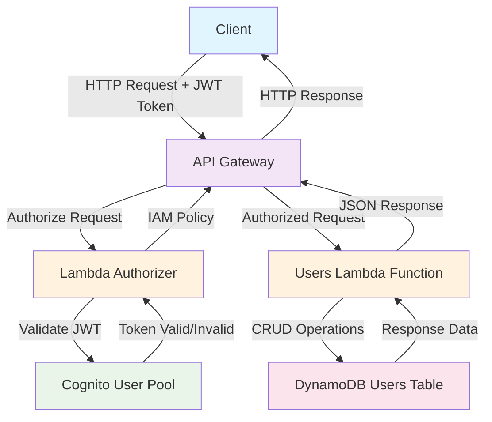

# Serverless Users API

A serverless REST API for user management built with AWS SAM, featuring JWT authentication via Amazon Cognito and DynamoDB storage.

## Architecture

- **API Gateway**: REST API endpoints
- **Lambda Functions**: Business logic (users CRUD + JWT authorizer)
- **DynamoDB**: User data storage
- **Cognito**: User authentication and JWT token validation

## Data Flow Diagram



## API Endpoints

| Method | Path | Description | Auth Required |
|--------|------|-------------|---------------|
| GET | `/users` | List all users | Admin only |
| POST | `/users` | Create user | Admin only |
| GET | `/users/{userid}` | Get user by ID | Owner or Admin |
| PUT | `/users/{userid}` | Update user | Owner or Admin |
| DELETE | `/users/{userid}` | Delete user | Owner or Admin |

## Prerequisites

- AWS CLI configured
- AWS SAM CLI installed
- Python 3.10+

## Deployment

```bash
# Build the application
sam build

# Deploy with guided prompts
sam deploy --guided

# Or deploy with existing config
sam deploy
```

## Configuration

Environment variables are set automatically via SAM template:
- `USERS_TABLE`: DynamoDB table name
- `USER_POOL_ID`: Cognito User Pool ID
- `APPLICATION_CLIENT_ID`: Cognito App Client ID
- `ADMIN_GROUP_NAME`: Admin group name (default: apiAdmins)

## Authentication

The API uses JWT tokens from Cognito User Pool. Get a token using:

```bash
aws cognito-idp initiate-auth \
  --auth-flow USER_PASSWORD_AUTH \
  --client-id <CLIENT_ID> \
  --auth-parameters USERNAME=<username>,PASSWORD=<password> \
  --query 'AuthenticationResult.IdToken' \
  --output text
```

Include the token in requests:
```bash
curl -H "Authorization: <JWT_TOKEN>" https://<API_ENDPOINT>/users
```

## Authorization Rules

- **Regular users**: Can only access their own user data (`/users/{their-userid}`)
- **Admin users**: Can access all endpoints and manage all users

## Local Testing

Test individual functions locally:

```bash
# Test users function
sam local invoke UsersFunction -e events/event-get-all-users.json

# Test with environment variables
sam local invoke UsersFunction -e events/event-post-user.json --env-vars env.json
```

## Project Structure

```
├── src/api/
│   ├── users.py          # Users CRUD operations
│   └── authorizer.py     # JWT token validation
├── events/               # Test event files
├── tests/               # Unit and integration tests
├── template.yaml        # SAM template
└── requirements.txt     # Python dependencies
```

## Dependencies

- `boto3`: AWS SDK
- `python-jose`: JWT token handling
- `datetime`: Timestamp generation

## Outputs

After deployment, the stack outputs:
- API Gateway endpoint URL
- Cognito User Pool details
- Authentication command examples